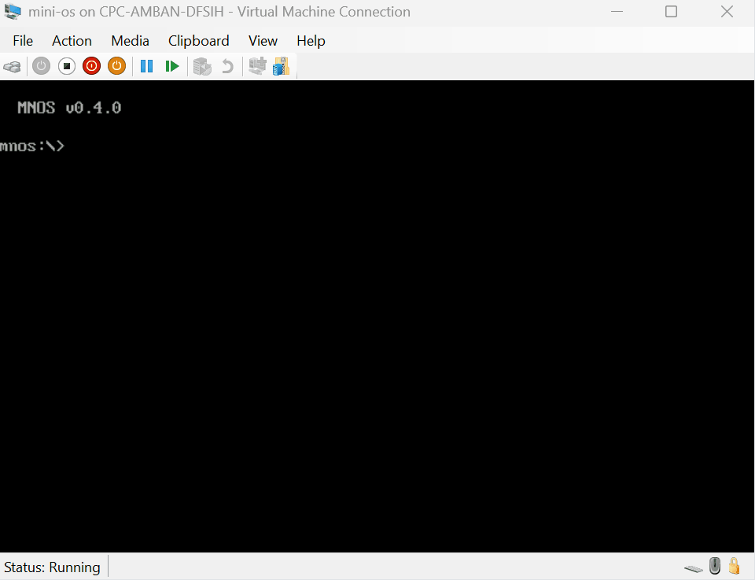

# mini-os

A minimalistic operating system, built from scratch — currently at **v0.7.4**.
MBR reads the partition table, chain-loads a VBR which loads a stage-2 loader
(A20 gate enablement), which loads a 16-bit kernel (KERNEL.BIN) that provides
an INT 0x80 syscall interface, which loads the filesystem module (FS.BIN) with
an INT 0x81 filesystem API, and finally the interactive shell (`mnos:\>`) with
commands for system info, CPU details, memory diagnostics, directory listing,
version info, and more.



[](../../actions/workflows/build.yml)

## Prerequisites

| Tool | Purpose | Install |
|------|---------|---------|
| **NASM** | x86 assembler | [nasm.us](https://www.nasm.us/) — or let `build.bat` download it automatically |
| **PowerShell 7+** | Build system & VHD creation | [aka.ms/powershell](https://aka.ms/powershell) |

## Quick Start

```cmd
build.bat
```

The build script will:
1. Download NASM into `tools/nasm/` if not already installed
2. Assemble MBR, VBR, LOADER, FS, KERNEL, and SHELL binaries
3. Create `build/boot/mini-os.vhd` (16 MB fixed VHD with partition table)

### Debug build

```cmd
build.bat /debug
```

Adds serial logging, syscall tracing, assertion macros, and boot milestone
messages via COM1 (115200 baud, 8N1). Assert failures dump registers to serial
and halt the CPU. CPU fault handlers are present in both builds — release shows
exception name, CS:IP, registers, FLAGS, and stack on screen; debug additionally
logs to serial. See `doc/DEBUGGING.md` §3–6 for details.

To read serial output from a debug build (requires admin — manages VM lifecycle):

```cmd
:: Build debug, setup VM, then capture serial from boot:
build.bat /debug
setup-vm.bat
read-serial.bat
```

`read-serial.bat` stops the VM, restarts it, and immediately connects to the
COM1 pipe — capturing boot messages from the first byte. On VM reboot or
reset, it auto-reconnects. Press Ctrl+C to stop.

## Running in Hyper-V

```cmd
:: First time — creates the VM and attaches the VHD (requires Admin)
setup-vm.bat

:: After rebuilding — updates the VM's VHD in-place
build.bat
setup-vm.bat
```

The script will prompt for a VM name and location (defaults are fine), then create a Gen 1 / 32 MB RAM VM with no network adapter and COM1 mapped to `\\.\pipe\minios-serial` for serial debug output. When both release and debug VHDs exist, it prompts which one to attach. On repeat runs it stops the VM, swaps in the chosen VHD, and leaves it ready to start.

You should see the MBR banner and partition table info, then the shell:

```
  MNOS v0.7.4

mnos:\>
```

Type `help` for a list of commands:

| Command | Description |
|---------|-------------|
| `sysinfo` | 5 pages of hardware info (CPU/CPUID, memory/E820, BDA, video/disk/EDD, IVT) |
| `mem` | Memory diagnostics — conventional/extended RAM, A20 gate, layout, E820 map |
| `dir` | List files on disk (name, type, sectors, bytes) |
| `ver` | Version, architecture, platform, and build info |
| `help` | List available commands |
| `cls` | Clear screen |
| `reboot` | Warm reboot |

```powershell
Start-VM -Name 'mini-os'           # start the VM
vmconnect localhost 'mini-os'      # open the console
```

## Project Structure

```
mini-os/
├── .github/
│   ├── ISSUE_TEMPLATE/       # Bug report & feature request templates
│   └── workflows/
│       ├── build.yml         # CI — build & verify on push/PR
│       └── release.yml       # CD — package & release on version tags
├── doc/
│   ├── DESIGN.md             # Architecture & design document
│   ├── BOOT-LAYOUT-RATIONALE.md  # Boot chain design rationale (DOS/Windows/Linux comparisons)
│   ├── MEMORY-LAYOUT.md      # Memory map, stack analysis, protected-mode roadmap
│   ├── CPU-MODES-AND-TRANSITIONS.md  # 16→32→64-bit journey, BIOS vs UEFI
│   ├── MNEX-BINARY-FORMAT.md    # Custom binary format spec, toolchain, build pipeline
│   └── SYSTEM-CALLS.md         # User↔kernel boundary, IVT/IDT/SYSCALL mechanisms
├── src/
│   ├── include/               # Shared constants & subroutines (%include)
│   │   ├── bib.inc            # Boot Info Block field addresses
│   │   ├── memory.inc         # Component load addresses
│   │   ├── mnfs.inc           # MNFS filesystem constants & INT 0x81 numbers
│   │   ├── find_file.inc      # Bootstrap MNFS directory lookup subroutine
│   │   ├── syscalls.inc       # INT 0x80 syscall function numbers
│   │   ├── load_binary.inc    # Shared MNEX binary loader subroutine
│   │   ├── serial.inc         # COM1 serial I/O (debug build only)
│   │   └── debug.inc          # DBG/ASSERT macros (debug build only)
│   ├── boot/
│   │   ├── mbr.asm           # MBR — partition table scan + VBR chain-load
│   │   └── vbr.asm           # VBR — finds LOADER.BIN via MNFS directory
│   ├── loader/
│   │   └── loader.asm        # Stage-2 loader — A20 gate, finds KERNEL.BIN via MNFS
│   ├── kernel/
│   │   └── kernel.asm        # 16-bit kernel — INT 0x80 syscalls, loads FS.BIN + SHELL
│   ├── fs/
│   │   └── fs.asm            # Filesystem module — INT 0x81 API, MNFS directory cache
│   └── shell/
│       └── shell.asm         # Interactive shell (user-mode, dir/sysinfo/mem/ver/help/cls/reboot)
├── tools/
│   ├── build.ps1             # Build logic (called by build.bat)
│   ├── create-disk.ps1       # Partitioned raw disk image creator
│   ├── create-vhd.bat        # VHD tool — batch wrapper
│   ├── create-vhd.ps1        # Raw image → VHD converter (pure PowerShell)
│   ├── setup-vm.ps1          # Hyper-V VM create/update logic
│   ├── read-serial.ps1       # Read COM1 debug output from running VM
│   └── nasm/                 # Auto-downloaded NASM (gitignored)
├── build/                    # Build output (gitignored)
│   └── boot/
│       ├── mbr.bin
│       ├── vbr.bin
│       ├── loader.bin
│       ├── fs.bin
│       ├── kernel.bin
│       ├── shell.bin
│       ├── mini-os.img
│       └── mini-os.vhd
├── build.bat                 # Build entry point
├── read-serial.bat           # Read serial debug output from VM
├── setup-vm.bat              # Hyper-V VM setup entry point
├── CHANGELOG.md
├── CODE_OF_CONDUCT.md
├── CONTRIBUTING.md
├── LICENSE
└── README.md
```

## Design & Architecture

See **[doc/DESIGN.md](doc/DESIGN.md)** for the full architecture document — boot sequence,
memory layout, VHD format, shell internals, disk layout, and project roadmap.

Additional deep-dive documents:

- **[doc/FILESYSTEM.md](doc/FILESYSTEM.md)** — MNFS flat filesystem specification:
  directory format, 8.3 filenames, FS.BIN module architecture, INT 0x81 API,
  bootstrap vs runtime filesystem access, and build pipeline integration.

- **[doc/BOOT-LAYOUT-RATIONALE.md](doc/BOOT-LAYOUT-RATIONALE.md)** — Why the three-stage boot
  chain? Comparisons with DOS 6.22, Windows NT/XP, and Linux/GRUB. Analysis of
  LBA gap vs. partition-internal loading, and clobber protection strategies.

- **[doc/MEMORY-LAYOUT.md](doc/MEMORY-LAYOUT.md)** — Exhaustive real-mode memory map showing
  every region (IVT, BDA, BIB, LOADER, SHELL, stack). Stack sizing analysis,
  transient vs. permanent memory, and the roadmap from A20 to protected mode.

- **[doc/CPU-MODES-AND-TRANSITIONS.md](doc/CPU-MODES-AND-TRANSITIONS.md)** — The complete
  journey from 16-bit real mode to 32-bit protected mode to 64-bit long mode.
  GDT, IDT, paging, hardware drivers (VGA, keyboard, ATA), PIC remapping, and
  a detailed BIOS vs UEFI comparison.

- **[doc/MNEX-BINARY-FORMAT.md](doc/MNEX-BINARY-FORMAT.md)** — The MNOS Executable format
  specification: unified 32-byte MNEX headers for all binaries (16/32/64-bit),
  NASM+Clang toolchain rationale, complete build pipeline, and C kernel code examples.

- **[doc/SYSTEM-CALLS.md](doc/SYSTEM-CALLS.md)** — How user-mode code talks to the kernel.
  Covers the IVT (16-bit), IDT with ring transitions (32-bit), and SYSCALL/SYSRET
  (64-bit). Includes complete handler code, Windows/Linux comparisons, and the
  mini-os syscall table.

- **[doc/DEBUGGING.md](doc/DEBUGGING.md)** — Serial logging (COM1), syscall tracing,
  user-mode debug syscalls (SYS_DBG_PRINT/HEX16/REGS with caller tags),
  debug build mode, and planned facilities (mnmon, assertions).
  Covers Hyper-V COM port setup and build integration.

## Version History

Each version is a tagged release you can checkout to see the project at that stage.

| Tag | Description | What you'll see |
|-----|-------------|-----------------|
| `v0.1.0` | **M0 — Hello World** | MBR prints "mini-os" and halts |
| `v0.2.0` | **M1 — Partition table + VBR** | MBR scans partition table, chain-loads VBR from active partition |
| `v0.2.1` | **Multi-sector boot area** | VBR header (`MNOS` magic + sector count), MBR two-phase load, heavily commented code |
| `v0.2.2` | **System info display** | VBR shows 4 pages of hardware info (memory, BDA, video/disk, IVT) |
| `v0.2.5` | **M2 — Interactive shell** | `mnos:\>` prompt with `sysinfo`, `help`, `cls`, `reboot` commands |
| `v0.2.6` | **`mem` command** | Detailed memory info: conventional/extended RAM, A20 gate status, memory layout, E820 map |
| `v0.2.7` | **`ver` + CPU/EDD sysinfo** | Version command, CPUID details page, EDD disk info, sysinfo now 5 pages |
| `v0.3.0` | **A20 gate enablement** | VBR enables A20 at boot (BIOS/8042/Fast A20 fallbacks), full memory access above 1 MB |
| `v0.4.0` | **Three-stage boot chain** | VBR → LOADER.BIN → SHELL.BIN split; A20 in loader, shell as separate binary, BIB at 0x0600 |
| `v0.5.0` | **16-bit Kernel + Syscalls** | KERNEL.BIN with INT 0x80 syscall interface; shell refactored to user-mode MNEX executable |
| `v0.6.0` | **MNFS Filesystem** | Flat filesystem, FS.BIN module with INT 0x81 API, `dir` command, no hardcoded disk offsets |
| `v0.7.0` | **Serial Debugging** | COM1 serial logging, debug macros, syscall/FS tracing, debug build mode (`build.bat /debug`) |
| `v0.7.1` | **User-Mode Debug Syscalls** | SYS_DBG_PRINT/HEX16/REGS (0x20–0x22) with caller tags, shell tracing |
| `v0.7.2` | **Assert Macros** | ASSERT, ASSERT_CF_CLEAR, ASSERT_MAGIC — halt + register dump on failure; 0 bytes in release |
| `v0.7.3` | **CPU Fault Handlers** | Trap #DE, #DB, #OF, #BR, #UD, #NM — exception name + CS:IP + register dump; debug only |
| `v0.7.4` | **Release Fault Handlers** | Fault handlers in both builds — release shows name, CS:IP, registers, FLAGS, stack top on screen; halts cleanly. Removed #DF (IRQ0 conflict). |

```cmd
git checkout v0.1.0      # see the project at any prior milestone
```

## Contributing

See [CONTRIBUTING.md](CONTRIBUTING.md) for guidelines.

## License

MIT — see [LICENSE](LICENSE).
